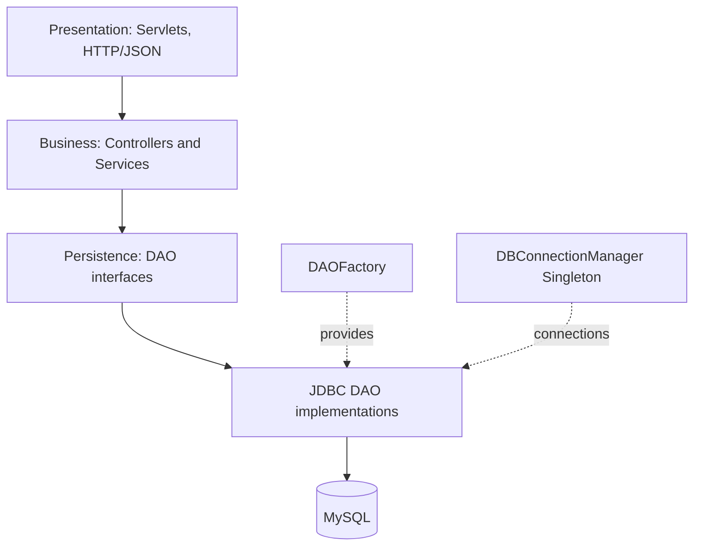

# OceanView Resort Reservation Management System


A Java EE (Servlet-based) web application for managing resort reservations, preventing booking conflicts, and generating invoices. Built for **CIS6003** as an internal tool for resort staff and administrators (not a guest self-service portal).

## Features

- **Double-booking prevention:** reservation requests are checked for conflicts before they are accepted.
- **Full reservation lifecycle:** create, look up, update, relocate, and cancel reservations.
- **Invoicing:** generate an invoice for a reservation and fetch it again later.
- **Room-type pricing:** pricing is calculated through interchangeable `PricingStrategy` implementations.
- **Staff authentication:** login and logout endpoints for internal users.
- **JSON API:** every operation is exposed as a JSON endpoint over HTTP.
- **Self-describing service:** `GET /help` returns a health check and the list of available routes.
- **Ready-to-run smoke tests:** copy-paste HTTP commands for auth, reservations, and billing in `tools/http/`.
- **Safe configuration:** database credentials live in a local, Git-ignored file. Only a template is committed.

<!-- Add screenshots from docs/screenshots here, for example:

-->

## Architecture

A 3-tier layered design. Services depend only on DAO interfaces, never on JDBC classes.



| Package | Responsibility |
|---|---|
| `presentation.servlet` | HTTP endpoints |
| `controller` | Use-case orchestration |
| `service`, `service.impl` | Business logic |
| `dao`, `dao.impl` | JDBC persistence |
| `factory` | `DAOFactory` |
| `config` | `DBConnectionManager` |
| `dto` | Request and response models |
| `mapper` | Entity to DTO mapping |
| `strategy` | `PricingStrategy` implementations |

### Design patterns

| Pattern | Where | Purpose |
|---|---|---|
| Singleton | `DBConnectionManager` | Central database configuration and connection creation |
| Factory Method / Simple Factory | `DAOFactory` | Returns DAO interfaces backed by their JDBC implementations |
| Builder | `ReservationRequestDTO.Builder` | Immutable construction of reservation requests |
| Strategy | `PricingStrategy` | Pricing calculation by room type |

## API

| Area | Method and path | Description |
|---|---|---|
| Auth | `POST /login` | Log in (JSON) |
| Auth | `POST /logout` | Log out (JSON) |
| Reservations | `POST /reservations` | Create a reservation |
| Reservations | `GET /reservations?reservationNo=...` | Fetch a reservation |
| Reservations | `PUT /reservations` | Update, relocate, or cancel |
| Reservations | `DELETE /reservations?reservationNo=...` | Delete a reservation |
| Billing | `POST /billing` | Generate an invoice |
| Billing | `GET /billing?reservationNo=...` | Fetch an invoice |
| Help | `GET /help` | Health check and route list |

## Getting started

**Prerequisites:** JDK 17, Maven, Tomcat 9 (`javax.servlet`), MySQL.

1. **Create the database**

   Create a MySQL database, for example `oceanview_resort`, then run:
   - `database/schema.sql`
   - `database/data.sql`

2. **Configure credentials (local only, never committed)**

   Copy `src/main/resources/db.properties.example` to `src/main/resources/db.properties` and fill in your own values:

   ```properties
   db.url=jdbc:mysql://localhost:3306/oceanview_resort?useSSL=false&allowPublicKeyRetrieval=true&serverTimezone=UTC
   db.username=CHANGE_ME
   db.password=CHANGE_ME
   ```

3. **Build the WAR**

   ```
   mvn clean package
   ```

4. **Deploy and start**

   Copy `target/oceanview-resort-rms.war` to `<TOMCAT_HOME>/webapps/`, then run `<TOMCAT_HOME>/bin/startup.bat`.

5. **Open the app**

   ```
   http://localhost:8080/oceanview-resort-rms/
   ```

## Verifying the API

Ready-to-run HTTP commands are in `tools/http/`:

- Auth: `SMOKE_TESTS.md`
- Reservations: `SMOKE_TESTS-reservation.md`
- Billing: `SMOKE_TESTS-billing.md`

## Testing and CI

- **Current state:** verification is done through the manual HTTP smoke tests above. There is no automated unit test suite yet.
- **CI:** the GitHub Actions workflow (`.github/workflows/ci.yml`) runs `mvn clean test` on pushes to `main` and on manual trigger. At present it acts as a compile and build check.

## Common issues

| Symptom | Cause and fix |
|---|---|
| 404 | WAR not deployed, or wrong context path (expected `/oceanview-resort-rms`) |
| Database errors | Create `src/main/resources/db.properties` and make sure MySQL is running |
| 400 Invalid JSON | Send the header `Content-Type: application/json` |